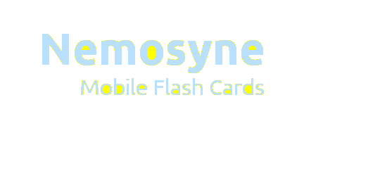
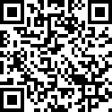
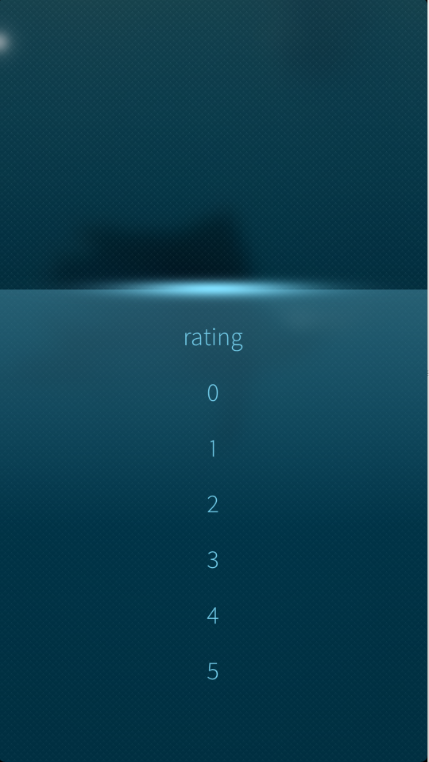
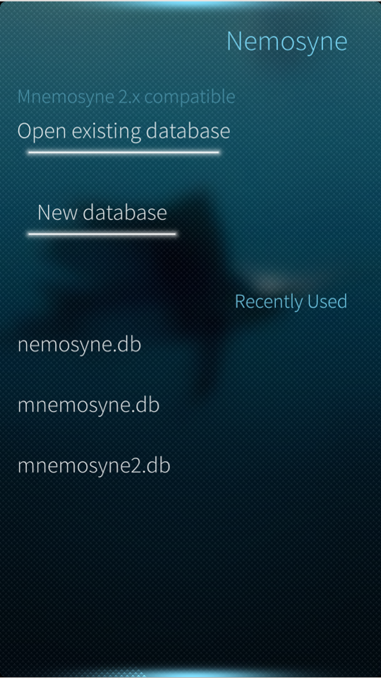

<h1>Hiatus</h1>
I'm taking a break from Sailfish development this summer so if anyone wishes to add patches or take over development please let me know.  It pains my heart, but putting this out there will hopefully inspire other people to step up. Thank you for your understanding.

今年の夏季、日本語能力試験の一級の検定をご勉強致して休憩を取らせていただきます。御了知頂いてありがとうございます。

<h2>About</h2>
Mnemosyne port to Sailfish OS. Mnemosyne is a flash card program (written in Qt) that is compatible with Linux, Windows, and MacOs. The Mnemosyne Project is located at . This is an independent porting effort, and I have no affiliation with Mnemosyne Project.

<h2>License</h2>

This project is GPLv3 unless otherwise indicated on the file itself. Files with other licenses are copyrighted to their respective owners.

1.6.0

<h2>Current Release</h2>
To get the latest updates you can always download this project and compile a binary. The official releases are tagged with to coincide with the official package that is up on the Jolla Store.

<h3>Road Map</h3>
version 1.6
<ul>
  <li>tag support</li>
</ul>
future
<ul>
  <li>Anki Support</li>
  <li>Application Interface Language Selection - <strong>DONE</strong></li>
</ul>

<h3>Stable Releases</h3>
<ul>
  <li>1.5.1</li>
  <li>1.4.1</li>
  <li>1.3.1</li>
  <li>1.2.3</li>
  <li>1.1</li>
  <li>1.0</li>
</ul>

<h2>Contribute</h2>

This application is open source,  but please do contribute to active development!

You can contribute in any of the following ways:
<ul>
<li>Fork this branch and make pull request! (Please create an issue ticket first, though)
<li>Provide Translations
<li>Donate Bitcoins
</ul>

<h3>Translations</h3>

You can add translations on at <a href="https://www.transifex.com/projects/p/harbour-nemosyne/">Transifex</a>. I will incorporate translations into the application and give contributors an honorable mention within the application!

<code>1PFqgHeGrtXLYvMge2mTT1FohKuuoKmUN5</code>

 
Copyright ©2014-2015 Dametrious Peyton. All Rights Reserved
